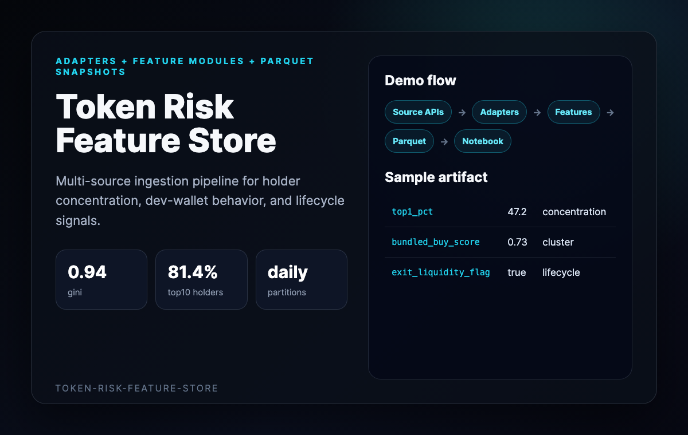
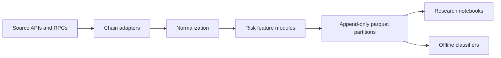
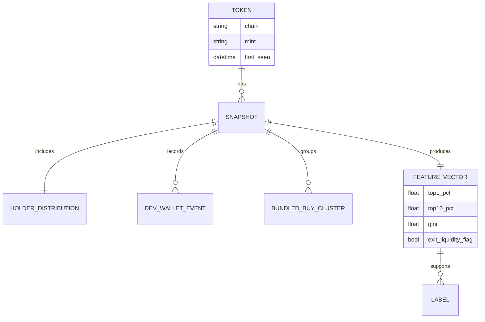
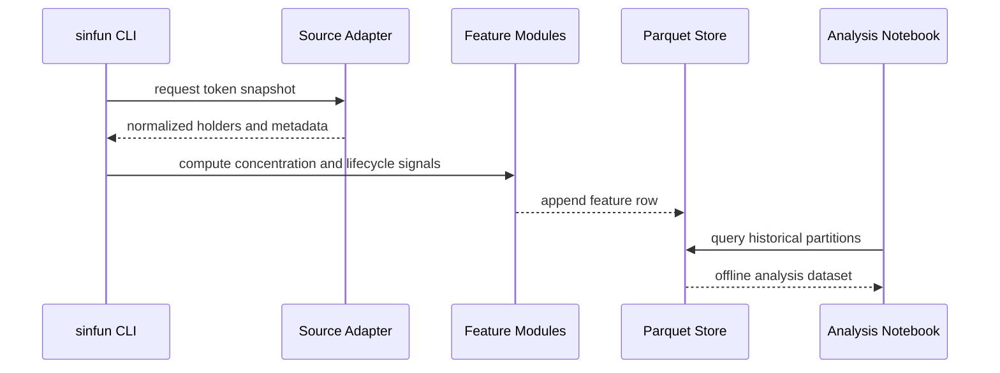

# Token Risk Feature Store Demo

This walkthrough presents the repo as a feature pipeline for noisy, fast-moving
token markets.



## Flow Chart



## Entity Graph



## Sequence Diagram



## Sample Feature Row

```json
{
  "chain": "solana",
  "mint": "MINT_ADDRESS",
  "snapshot_day": "2026-05-17",
  "top1_pct": 47.2,
  "top10_pct": 81.4,
  "gini": 0.94,
  "bundled_buy_score": 0.73,
  "exit_liquidity_flag": true
}
```
